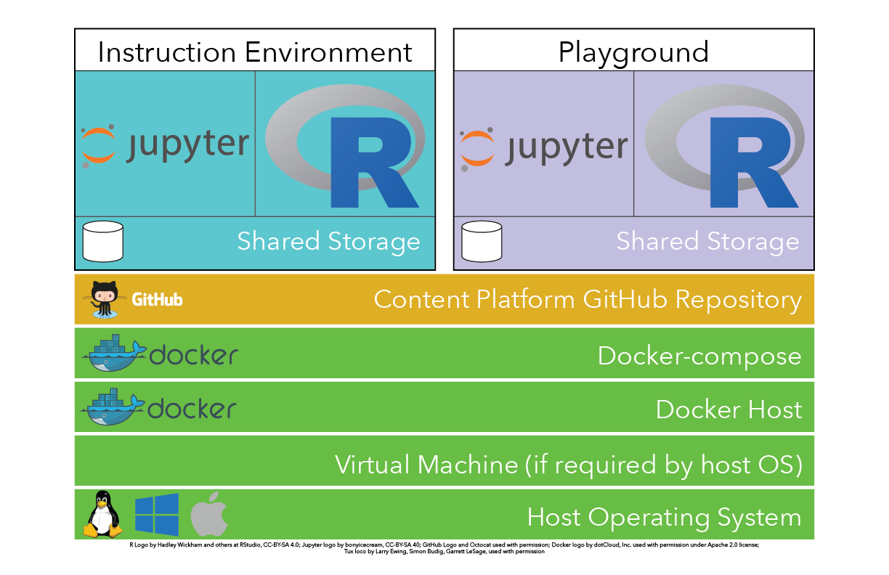

# UNM RDS Content Platform for the Coffee & Code Workshop Series

This repository contains the needed code to replicate the presentation and playground environments used for the UNM Research Data Services (RDS) Coffee & Code workshop series.  The materials in this repository leverage Docker as a platform for developing and deploying portable containers that support individual applications. In the case of the Coffee & Code instruction platform, the applications that are integrated into the system include:

* Jupyter Notebooks as a presentation, demonstration, and experimentation environment (based on the [datascience-notebook container](https://github.com/jupyter/docker-stacks/tree/master/datascience-notebook) with the addition of [Pandoc](https://pandoc.org) and [LaTeX](https://www.latex-project.org))
* A web-based RStudio environment (based on the [rocker/rstudio](https://github.com/rocker-org/rocker) with the addition of the R `dplyr`, `ggplot2`, `ggrepel`)
* Installed tools within the Jupyter Notebook platform include:
	- Git
	- Pandoc & LaTeX
	- BASH shell
	- Python
	- R

When initiated, the Coffee & Code instruction environment creates one or two instances of the instruction environment depending on your needs, and the startup command that you run. 

* One from which the presentation/demonstration can be run
* A second *Plaground* instance that contains all of the presentation and demonstration materials that workshop participants can experiment with during the workshop. 

These platforms are accessible over the web on the host that RDS maintains at:

For the *Playground*\
Jupyter Notebook: [http://cc.unmrds.net:8888](http://cc.unmrds.net:8888)\
RStudio: [http://cc.unmrds.net:8787](http://cc.unmrds.net:8787)

and

For the *Instruction* platform\
Jupyter Notebook: [http://cc.unmrds.net:8889](http://cc.unmrds.net:8889)\
RStudio: [http://cc.unmrds.net:8788](http://cc.unmrds.net:8788)

When run on a local computer the two environments will be available at: 

[http://localhost:8888](http://localhost:8888) and [http://localhost:8787](http://localhost:8787) for the *playground*

[http://localhost:8889](http://localhost:8889) and [http://localhost:8788](http://localhost:8788) for the *instruction* platform

## Running the platform on your local workstation or on a server

To run the full environment, including downloading all of the workshop materials into the working copy of the platform, you need to have an operating Docker environment on your system that includes both the core Docker engine, and support for the `docker-compose` system. The installation and execution code provided in this repository has been developed and tested with the [Docker Community Edition (CE)](https://www.docker.com/community-edition). Infomation about the Docker CE platform and instructions for installing Docker CE on your system can be found here:

[https://www.docker.com/community-edition](https://www.docker.com/community-edition). 

Once you have an operational Docker system on your computer, download (and unzip) a [zipfile](https://github.com/unmrds/cc-content-platform/archive/master.zip) containing the contents of the repository, or if you use [Git](https://git-scm.com) you can also clone the repository to your local computer using the 

    git clone https://github.com/unmrds/cc-content-platform.git 

command. 

From within the repository directory you have two options, both executed from the appropriate *command line* tool for your operating system:

1. Run only the *playground* environment - **the most useful option for workshop participants and for self-paced learning.** 

	docker-compose up -d --build

command. As noted above, once running, the platform should be available through a web browser on your local computer at:

[http://localhost:8888](http://localhost:8888) and [http://localhost:8787](http://localhost:8787) for the *playground*

2. To run both the *playground* and *instruction* environments in parallel on your system - allowing for providing instruction from one 

	docker-compose -f docker-compose-full up -d --build

command. As noted above, once running, the platform should be available through a web browser on your local computer at:

[http://localhost:8888](http://localhost:8888) and [http://localhost:8787](http://localhost:8787) for the *playground*

[http://localhost:8889](http://localhost:8889) and [http://localhost:8788](http://localhost:8788) for the *instruction* platform

In both cases these commands will download and build all of the necessary components of the platform, and start it running. This initial build process (which may take some time, based on the speed of your network connection and your computer) is only executed the first time you run the command and when changes are made to the instructions for building and running the platform. Future excution of this command will go much more quickly as the previously built components will be reused.  

**The default password for both the *playground* and the *instruction* Jupyter Notebook component is `password`. The username and password for the RStudio component for both platforms is `rstudio` (for both the username and password). See below for instructions for changing the default password for your copy of the platform.**

To shutdown the platform running on your system issue a `docker-compose down` command from the same directory where the platform was run from. 

## Changing the Default Password For Local or Server-based Platform

The passwords used by the *instruction* and *playground* platforms are defined in the startup scripts that are run when starting the platform. Changing those passwords is a two-step process:

1. Generate a SHA1 password hash for your chosen password. You can use the `SHA1 Password Calculator.ipynb` included in this repository, and included in the collection of workshop repositories transferred into the platform when it is started up. 

2. Replace the default password in one or both startup scripts with the new SHA1 password hash. Specifically, the startup scripts for the *instruction* and *playground* platforms are:

    startup_instruction.sh
    
    startup_playground.sh

respectively. Each of these files contains local comments that indicate where the values should be changed. 

After changing the passwords in these files they will be enabled when the platforms are restarted by using the `docker-compose down` and desired `docker-compose up` command highlighted above. 
